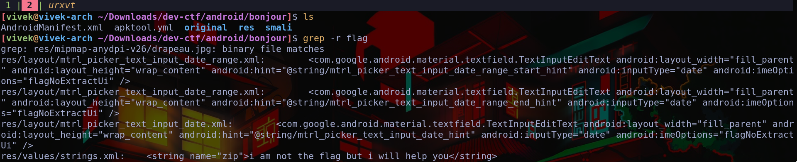

# Bonjour
In the beginning I had no clue on what to do in the challenge. The decompilation yielded no result, the app wasn't doing much. I had used apktool
to decompile the apk, I randomly decided to grep for interesting strings recursively (this trick has been quite useful to me in the past).



We find the line,
```bash
res/values/strings.xml:    <string name="zip">i_am_not_the_flag_but_i_will_help_you</string>
```
hmmm ok, we'll keep it in mind. Just to be sure I went into `res/values/strings.xml` and looked through all the strings, but couldn't find anything
important. But wait, look at the first line in the image above,

```bash
grep: res/mipmap-anydpi-v26/drapeau.jpg: binary file matches
```
binary file matches. This image contains the string "flag" for some reason. Sus. Opening it in our favourite text editor and looking for it we find 
the word "flag.txt". At this point I was pretty sure the file was important (there was bunch of random text in it as well).

This was now looking like a steganography challenge. Trying to unzip the file gives us,
```bash
[vivek@vivek-arch ~]$ unzip drapeau.jpg 
Archive:  drapeau.jpg
warning [drapeau.jpg]:  185099 extra bytes at beginning or within zipfile
  (attempting to process anyway)
[drapeau.jpg] flag.txt password: 
```
So the image contains a hidden zip containing `flag.txt` and it's password protected. Using binwalk we can extract just the zip out of it,
```bash
[vivek@vivek-arch ~]$ binwalk --dd='.*' drapeau.jpg 

DECIMAL       HEXADECIMAL     DESCRIPTION
--------------------------------------------------------------------------------
0             0x0             JPEG image data, JFIF standard 1.01
759           0x2F7           XML document, version: "1.0"
8254          0x203E          XML document, version: "1.0"
72578         0x11B82         TIFF image data, big-endian, offset of first image directory: 8
77995         0x130AB         Copyright string: "Copyright (c) 1998 Hewlett-Packard Company"
185099        0x2D30B         Zip archive data, encrypted at least v2.0 to extract, compressed size: 33, uncompressed size: 21, name: flag.txt
185260        0x2D3AC         End of Zip archive, footer length: 22

[vivek@vivek-arch ~]$ mv _drapeau.jpg.extracted/2D30B flag.zip
```
Having gotten the zip file, we need the password. I tried bruteforcing using jtr and rockyou, but didnt work. That's when I remembered the string
that we encountered before. I just used it and it worked.

```bash
[vivek@vivek-arch ~]$ unzip -P 'i_am_not_the_flag_but_i_will_help_you' flag.zip 
Archive:  flag.zip
 extracting: flag.txt                
[vivek@vivek-arch ~]$ cat flag.txt 
ctf{voici_le_drapeau}%
```

