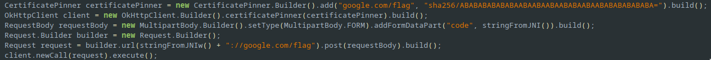
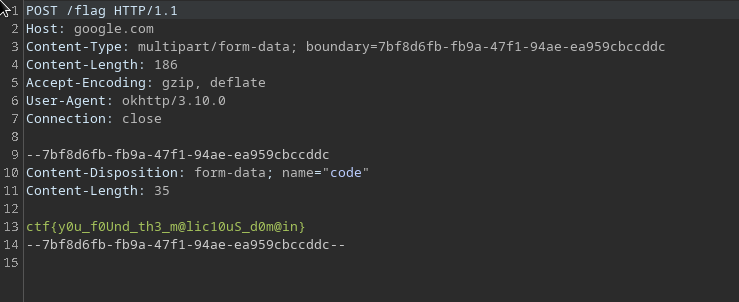

# Network
Looking through the decompilation of the app, we see this in com/example.hellojni/MainActivity2,


Looks like we are doing SSL pinning and making some request somewhere. I use magisk-frida on my rooted phone, using the frida script cert-pin.js we can easily bypass certificate pinning,

```bash
frida --no-pause -U -l ./frida-script.js -f com.example.hellojni
```

Then proxying the traffic through burp. Sure enough, there is our flag.

