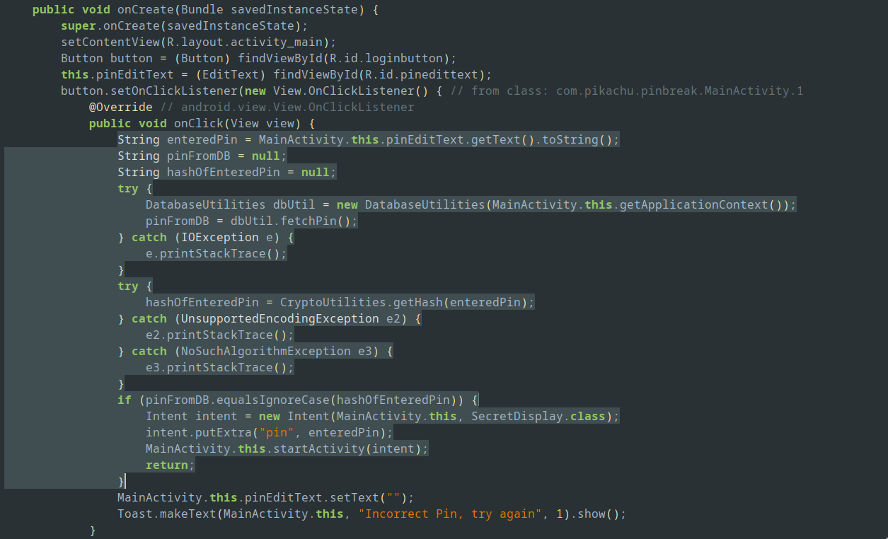
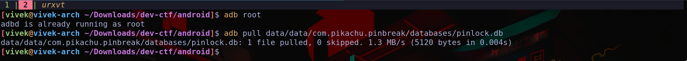
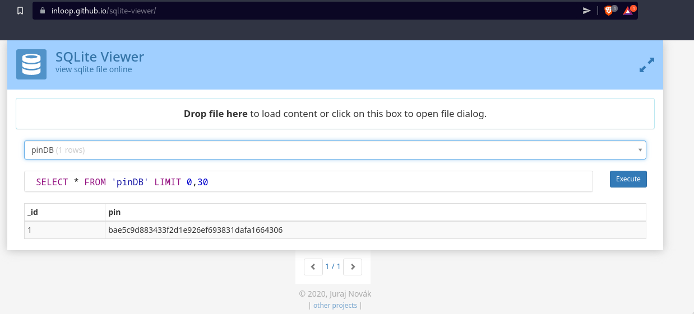
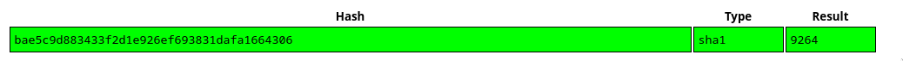

# PinBreak
Looking at the decompilation we see,

So the actual pin (it's hash) is fetched by `dbUtil.fetchPin()`, and our pin is hashed and compared with it. Looking at `fetchPin()`,
```java
    public String fetchPin() throws IOException {
        openDB();
        Cursor cursor = this.db.rawQuery("SELECT pin FROM pinDB", null);
        String pin = "";
        if (cursor.moveToFirst()) {
            pin = cursor.getString(0);
        }
        cursor.close();
        return pin;
    }
```

So we just need to get the database from the app. Since I have a rooted phone, I can directly access the file using adb.


Loading the file in an sqlite3 database viewer online,


Finally using https://crackstation.net/, we can lookup the pin whose hash is `bae5c9d883433f2d1e926ef693831dafa1664306`.


Entering this pin, we get our password.
