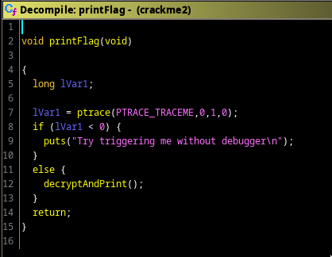
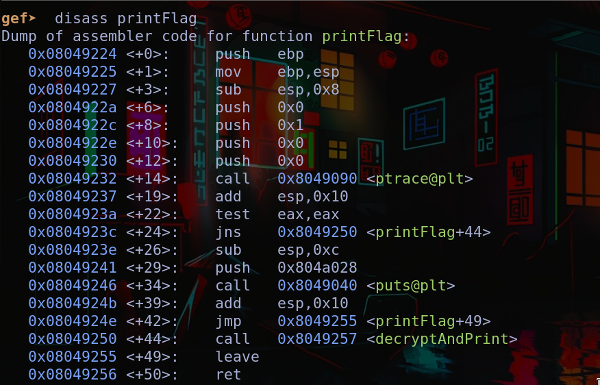
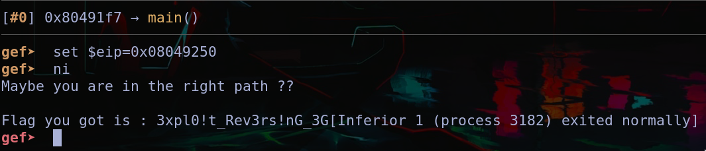

# ExcessChars
Looking through ghidra's decompilation, the first thing I saw was the function `printFlag()`. 

it checks whether we have attached a debugger, otherwise we call `decryptAndPrint()`. Fortunately we can just attach a debugger and just jump to
the address where this function is being called. 

So we just need to set `eip` to `0x08049250` and we will be done.

