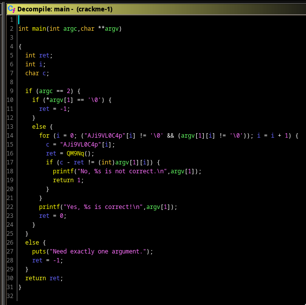
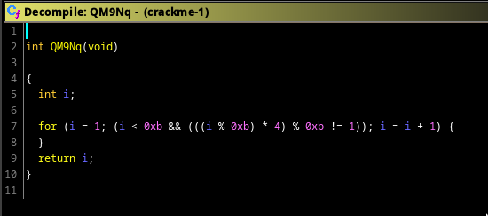
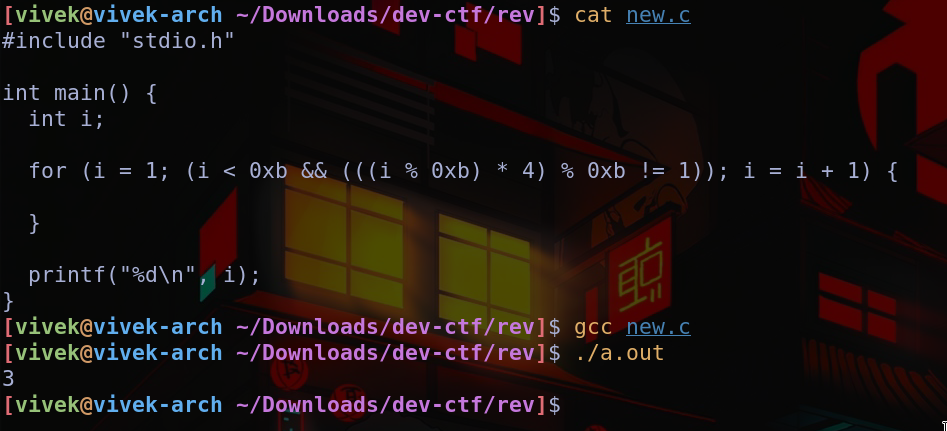
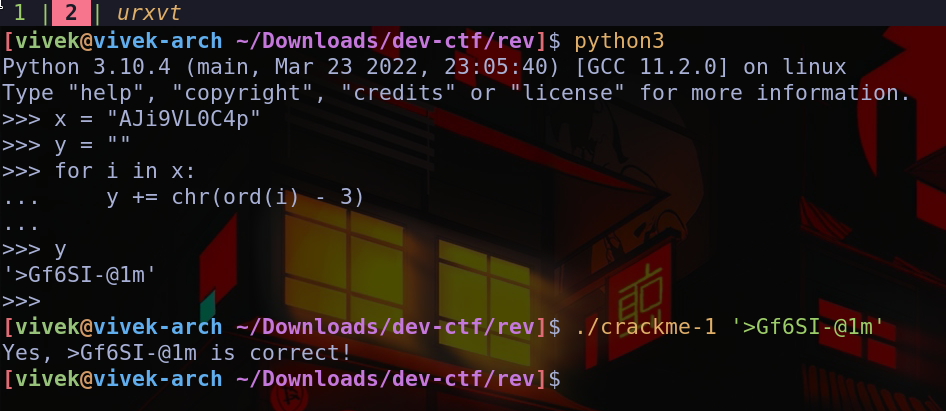

# GetArgs
Looking through ghidra's decompilation and cleaning it a bit,


Each character in our input must have value of `c - ret` according to the 
following,
```C
        if (c - ret != (int)argv[1][i]) {
          printf("No, %s is not correct.\n",argv[1]);
          return 1;
        }
```

`c` is just a character of `"AJi9VL0C4p"`, while `ret` is the value returned by `QM9NQ()`. 
Looking at the function in ghidra,

we'll see that it always returns a constant value. To see it's return value we can just create a simple c program
with the exact same function and check it's return value.

Finally to get the input,

