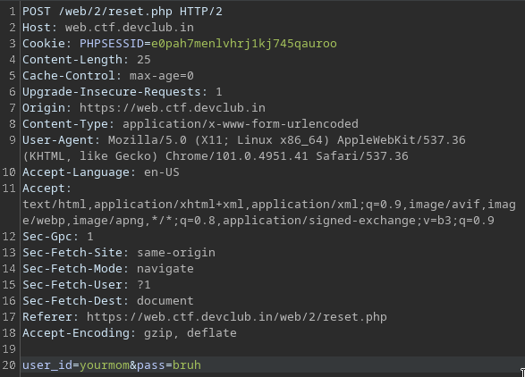
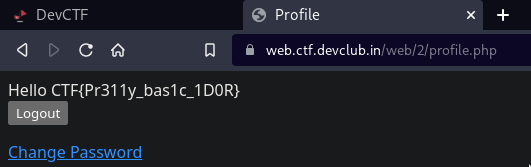

# UnChangeablePasswords
Notice the request for changing passwords in burp.

We are passing the `user_id` as well. We hope that this is an easy IDOR challenge and change `user_id` to admin. And there we have our flag,

