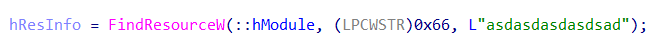
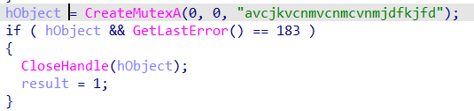
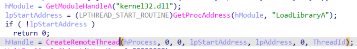
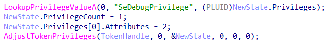
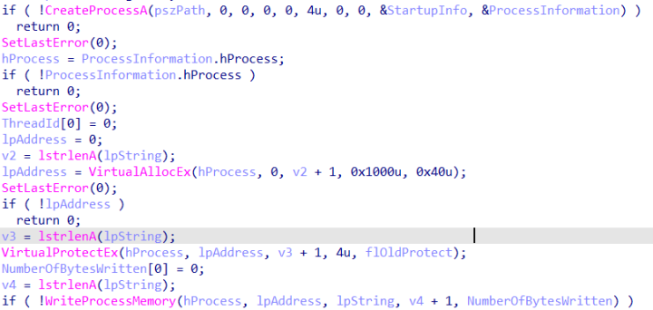
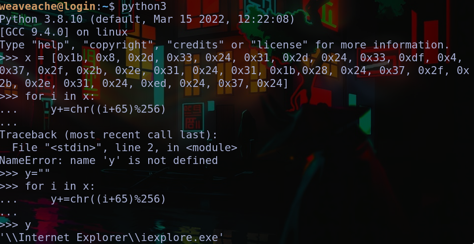
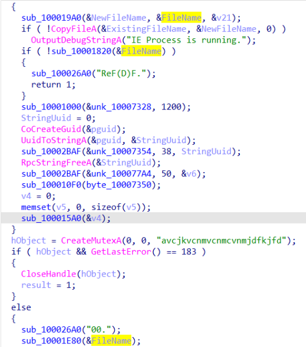
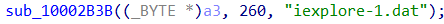

**(Caution: very lazy writeup ahead)** 
Open the .dll file in IDA pro.

# Payload

# Mutex

# WhichAddress?

# Privileged

# LevelUp

The `WriteProcessMemory()` call writes the payload into memory. The application is given
by the `pszPath` in `CreateProcessA`. The path was obfuscated a bit, but was easy to reverse.

# DropThis

